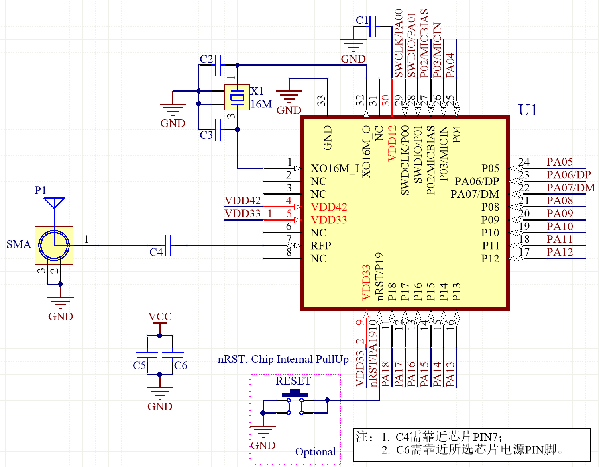
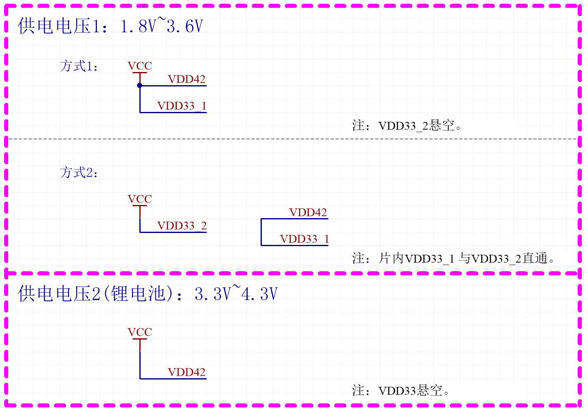

参考设计
========

========== ===== =============================== ==================
Designator Value Description                     Footprint
========== ===== =============================== ==================
C1         10nF  Capacitor,X7R,±10%              0402
C2,C3      NC
C4         2.2PF Capacitor,X7R,±10%              0402
C5         4.7uF Capacitor,X7R,±10%              0402
C6         100nF Capacitor,X7R,±10%              0402
X1         16MHz XTAL SMD3225,Cl=9pF,40Ω,±10ppm  Seam Seal 3225
========== ===== =============================== ==================