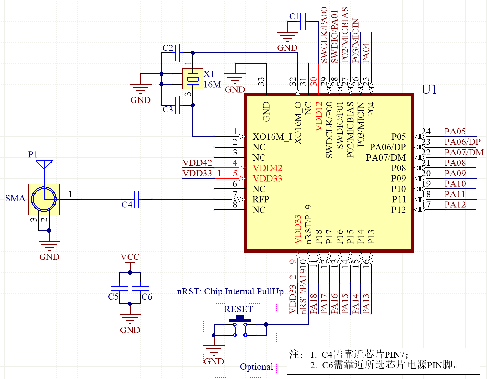
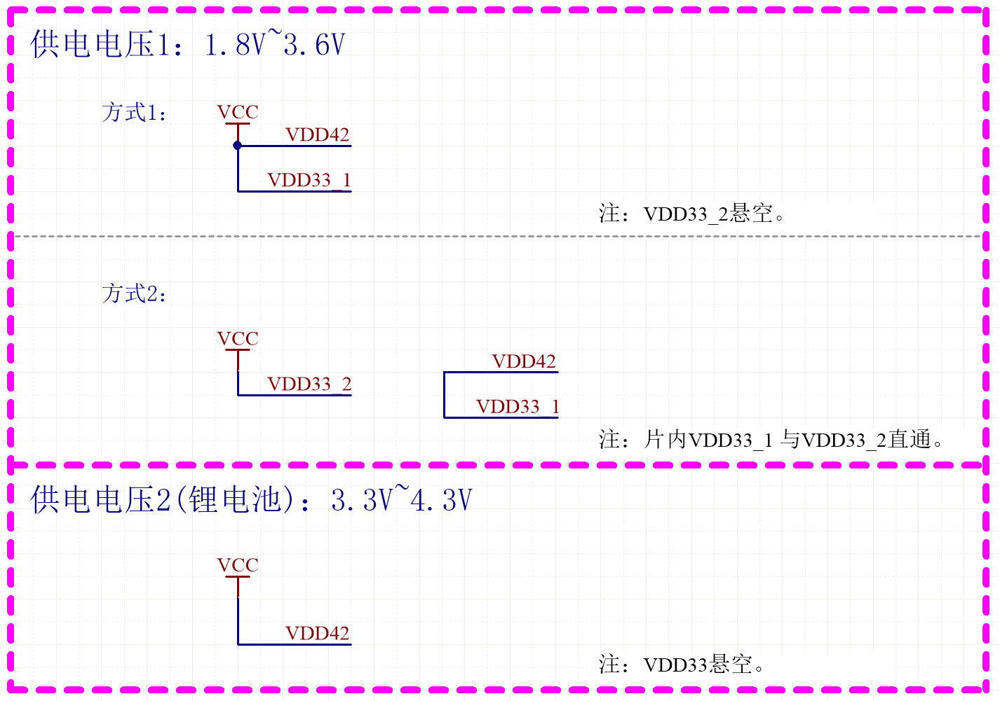

.. vim: syntax=rst

参考设计
========

.. list-table::
   :widths: 25 25 25 25
   :header-rows: 0

   * - **Designator**
     - **Value**
     - **Description**
     - **Footprint**

   * - C1
     - 10nF
     - Capacitor, X7R, ±10%
     - 0402

   * - C2, C3
     - NC
     -
     -

   * - C4
     - 2.2pF
     - Capacitor, X7R, ±10%
     - 0402

   * - C5
     - 4.7uF
     - Capacitor, X7R, ±10%
     - 0402

   * - C6
     - 100nF
     - Capacitor, X7R, ±10%
     - 0402

   * - X1
     - 16MHz
     - XTAL SMD 3225, 16MHz, Cl=9pF, 40Ω, ±10ppm
     - Seam Seal 3225