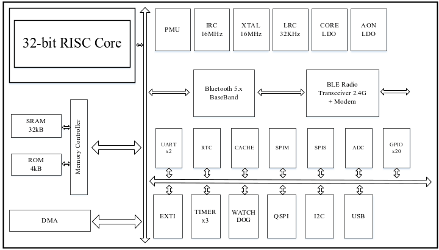

总体描述
==================

概述
----

  B6x系列芯片是一款超低功率、高性能和高集成的蓝牙5.2 BLE + 2.4G片上系统芯片, 设计用于在 2360MHz 至 2520MHz频段上运行。

  B6x系列芯片 采用先进的 CMOS 低漏电工艺制造, 具有最高的集成度、最低的功耗、最低的漏电电流和降低 BOM 成本, 同时简化了整个系统设计。

特性
----

- 蓝牙BT 5.2 + 2.4GHz(私有协议) SoC

  - 支持BLE速率: 1Mbps、2Mbps

  - 灵敏度-96dBm\@\1Mbps BLE 模式

  - 灵敏度-92dBm\@\2Mbps BLE 模式

  - 发射功率 -40dBm 至 6dBm

  - 单端天线输出

  - 集成balun

  - 支持BLE Mesh

- RISC 32位 MCU

  - 高性能 (64MHz)

- SMART 8通道DMA控制器

- CACHE

  - CACHE支持范围4KB

- USB

  - USB1.1 全速达到12Mbps

  - 最大支持5个端点, 端点1~4支持同时收发

  - 所有端点的FIFO深度64字节

- 片上存储器

  - 4KB ROM

  - 最大32KB SRAM

  - eSOP8(SIP 128KB QSPI FLASH)

  - SOP16(SIP 128KB QSPI FLASH)

  - QFN20/QFN32(SIP 256KB QSPI FLASH)

- 时钟源

  - 支持16MHz晶体振荡器(XTAL)

  - 内部高频RC振荡器(IRC) 16MHz +/- 2%

  - 内部低频RC振荡器的超低功率时钟(RC32K)

  - 内部高频DPLL48M/64M时钟

  - 支持外灌时钟

- 系统时钟(RTC)

  - 采用超低功耗技术运行

  - 由内部超低功耗RC运行

- 看门狗定时器

  - 由内部低功率WDT运行

- 计数器/定时器模块

  - 1路Advanced 16位计数器/定时器(ATMR)

  - 1路Common 16位计数器/定时器(CTMR)

    支持4个独立通道, 用于输入捕获、输出比较、PWM

  - 1路Basic 16位计数器/定时器(BTMR)

- 外设接口

  - 2路UART, 支持RS485/IrDA/ISO7816-3, 速率可达3.84Mbps

  - 1路SPI Master, 最高速率可达32Mbps

  - 1路SPI Slave, 最高速率可达24Mbps

  - 1路I2C总线, 可配主/从设备, 支持快速模式速率可达400Kbps

- 模拟-数字转换器(ADC)

  - 10位精度, 1Mbps ADC, 10个输入通道

  - 语音功能, 支持8K采样率

- 通用I/O(GPIO)

  - 最大支持20个GPIOs, 每个IO都支持中断和唤醒功能

- 电源管理(PMU)

  - 集成 Power-On-Reset (POR)

  - 集成Low-Voltage-Detect (LVD) , 默认电压阈值1.65V

- 电压范围

  - 工作电压 1.8V ~ 5.2V(由芯片型号定义)

- 电流功耗

  - 片上LDO稳压器

  - 44.7uA/MHz(@3.3V with 16M RC)

  - Deep sleep 模式下, 70 uA @3.3V

  - Power off模式下, 1uA @3.3V

  - BLE/2.4G 模式下, Tx峰值电流7.2mA (@1.8V 0dBm)

  - BLE/2.4G 模式下, Rx峰值电流10.3mA (@1.8V)

- ESD 4500V

- 工作温度-40℃ ~ 85℃(-40℃ ~ 105℃下单需要注明)

框图
----

