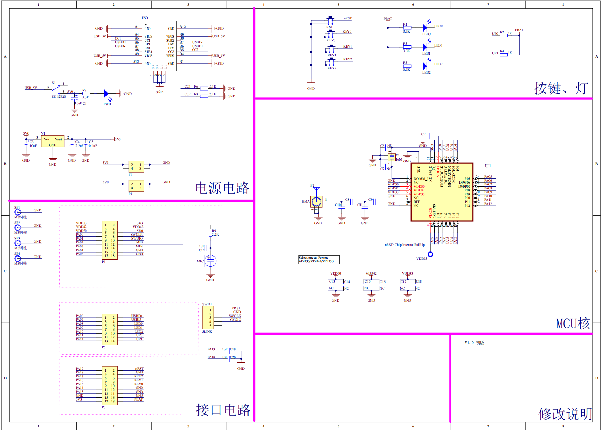
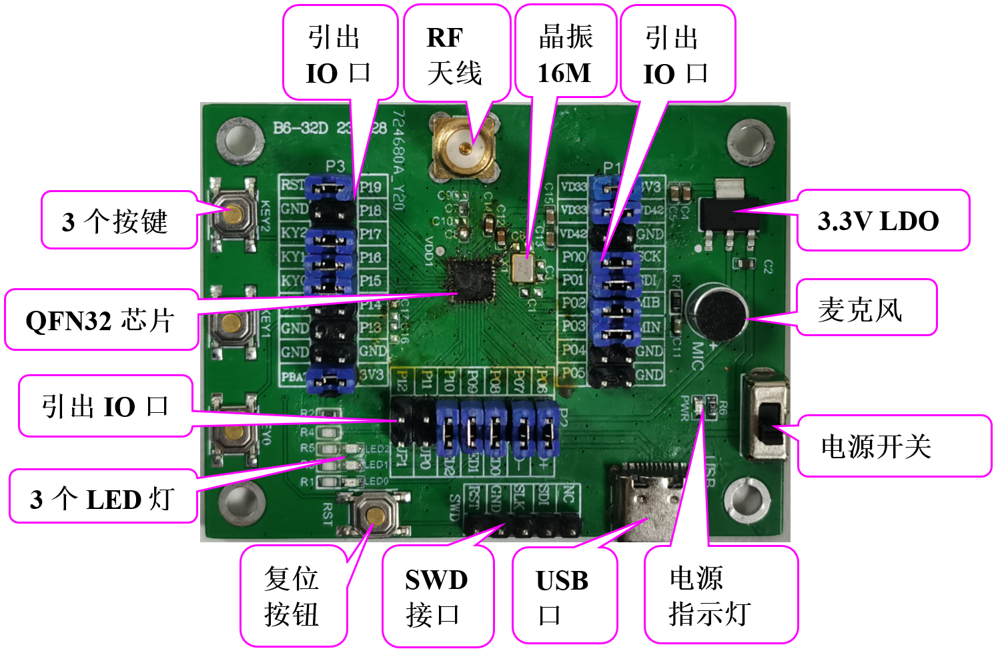

B6x开发板资源初探
======================

下面我们开始介绍B6x开发板的资源图, 原理图如图1-39所示, 实物俯视图如图1-40所示:

   图 1-39 B6x开发板原理图

   图 1-40 B6x开发板资源图

从图1-40可以看出, B6x开发板, 资源十分丰富.

B6x开发板板载资源如下:

- MCU:QFN32, FLASH:256K, SRAM:32K;

- 1个电源指示灯(PWR)

- 3个状态指示灯(LED0, LED1, LED2)

- 3个按键(KY0, KY1, KY2)

- 1个TypeC-USB口, 需下载USB程序

- 1个SWD调试下载口

- 1个复位按钮, 可用于复位MCU

- 1个电源开关, 控制整个板的电源

- 2个上拉5.1K电阻

- 1个麦克风

- 引出了20个GPIO口, 均可独立外用

硬件资源说明
~~~~~~~~~~~~~~~~~~

这里我们首先详细介绍B6x开发板的各个部分(图1-40中的标注部分)的硬件资源, 我们将按逆时针的顺序依次介绍.

引出IO口(总共有三处)
----------------------------------------

这是开发板IO引出端口, 总共有三组IO引出口, 20个GPIO口.

B6x
----------------------------------------

这是开发板的核心芯片, 型号为:B66. 封装引脚请参考 :ref:`QFN32-B66`.

RF射频天线
----------------------------------------

这是开发板的2.4G天线, 用于蓝牙无线射频.

晶振16M
----------------------------------------

这是开发板外部晶振16MHz, 9pF, 10ppm.

3个按键
----------------------------------------

这是开发板板载的三个按键, 在做程序调试, 或者开发的时候可能需要按键来辅助, 所以预留了三个, 可以使用跳帽选择, 如表
1-2所示.

3个LED灯
----------------------------------------

这是开发板板载的三个LED灯(LED0、 LED1和LED2).

如表 1-1所示:

.. table:: 表 1-1 按键、LED选择

   +-----------------------+--------------+--------------+--------------+
   | 按键跳帽              | GPIO15       | GPIO16       | GPIO17       |
   +-----------------------+--------------+--------------+--------------+
   | 功能                  | KY0          | KY1          | KY2          |
   +-----------------------+--------------+--------------+--------------+
   | LED灯跳帽             | GPIO08       | GPIO09       | GPIO10       |
   +-----------------------+--------------+--------------+--------------+
   | 功能                  | LED0         | LED1         | LED2         |
   +-----------------------+--------------+--------------+--------------+

左上角3.3V电源输入/输出
----------------------------------------

这是开发板板载的一组3.3V电源输入输出排针(2*2).

电源指示灯
----------------------------------------

这是开发板板载的一颗LED灯(PWR), 用于指示电源状态.

电源开关
----------------------------------------

这是开发板板载的电源开关.该开关用于控制整个开发板的供电, 如果切断, 则整个开发板都将断电, 电源指示灯(PWR)会随着此开关的状态而亮灭.

串口1/USB串口
----------------------------------------

这是开发板模组与上位机串口通信的接口, 如表 1-2所示.

.. table:: 表 1-2 USB/串口跳帽

   +----------------+----------------+----------------+
   | QFN32芯片(USB) | GPIO6          | GPIO7          |
   +----------------+----------------+----------------+
   | 上位机         | U+             | U-             |
   +----------------+----------------+----------------+

5V电源输入/输出
----------------------------------------

这是开发板板载的一组5V电源输入输出排针(2*2), 用于给外部提供5V的电源, 也可以用于从外部接5V的电源给板子供电.

复位按钮
----------------------------------------

这是开发板板载的复位按键(RESET), 用于复位B6x, 低电平有效.

SWD接口
----------------------------------------

这是开发板板载SWD调试接口, 与JLINK或者STLINK等调试器(仿真器)连接.

开发板IO引脚分配
~~~~~~~~~~~~~~~~~~

.. table:: 表 1-3 开发板IO 引脚分配

   ========== ============ ===============
   GPIO(独立) 跳帽连接资源  连接关系说明
   ========== ============ ===============
   PA00       SCK          Jlink
   PA01       SDI          Jlink
   PA02       MIB          麦克风
   PA03       MIN          麦克风
   PA04
   PA05
   PA06       UD+          USB
   PA07       UD-          USB
   PA08       L1           LED
   PA09       L2           LED
   PA10       L3           LED
   PA11       UP0          上拉5.1KΩ
   PA12       UP1          上拉5.1KΩ
   PA13
   PA14
   PA15       KY0          按键
   PA16       KY1          按键
   PA17       KY2          按键
   PA18
   PA19       RST          复位按键
   ========== ============ ===============
