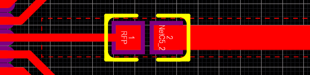
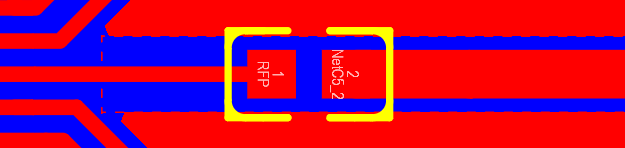

Layout注意事项
======================

参考地大而完整
~~~~~~~~~~~~~~~~~~~~~~~

大而完整的参考地是PCB射频性能的基础, 十分重要.双层板设计时, 应将底层作为参考地层.要做到参考地大而完整, 就要求双层板底层尽量不走线, 最好的效果是底层无任何走线, 如图
1-1和图 1-2.

+----------------------------------+----------------------------------+---------------------------------+
|.. figure:: ../_images/image1.png |.. figure:: ../_images/image2.png |.. figure:: ../_images/image3.png|
|   :alt: image1                   |    :alt: image2                  |    :alt: image3                 |
|   :height: 300px                 |    :height: 300px                |    :height: 300px               |
|   :align: center                 |    :align: center                |    :align: center               |
|                                  |                                  |                                 |
|   图 1-1                         |    图 1-2                        |    图 1-3                       |
+----------------------------------+----------------------------------+---------------------------------+

**注意:** 地平面实在无法保证充分完整性时, 首要保障下面3点:

| 1. RF信号走线下的参考地不被割裂;
| 2. 双端天线要保障天线参考地回流芯片地的完整性;
| 3. RF相关引脚(RF,VDD33,VDD12,XO16M_I,XO16M_O)参考地完整性.

**图 1-3** 由于PCB面积小只能勉强做到上述三点.

天线回流无阻隔
~~~~~~~~~~~~~~~~~~~~~~~

天线参考地尽快回流到芯片地, 所以在天线回流路径需要:**距离最短、没有阻隔、连接良好**.下面图中箭头为回流路径, 图
1-4和图 1-5都是优秀设计, 都做到了最短路径.

+---------------------------------+---------------------------------+
|.. figure:: ../_images/image4.png|.. figure:: ../_images/image5.png|
|   :alt: image4                  |    :alt: image5                 |
|   :height: 300px                |    :height: 300px               |
|   :align: center                |    :align: center               |
|                                 |                                 |
|   图 1-4                        |    图 1-5                       |
+---------------------------------+---------------------------------+

电容靠近芯片引脚, 就近过孔、独立接地、回流无阻隔
~~~~~~~~~~~~~~~~~~~~~~~~~~~~~~~~~~~~~~~~~~~~~~~~~~~~~~~~~~~~~~

芯片周围会有一些滤波电容, 这些电容的接地脚需要有单独过孔接至底层, 并保证回流到芯片地的路径上没有阻隔.

图1-6选中的4个(白色)电容布局不合理.其中, 上面三个电容GND脚共用1个过孔(紫色箭头)接至底层GND, 没有做到“独立过孔接地”.下面电容虽然单独接地, 但是过孔距离较远, 延长了回流路径.上面两个电容的共性问题是他们接地铺铜被一条走线(蓝色)阻隔, 延长了回流路径.同时, 下面电容距离芯片引脚较远.

+---------------------------------+----------------------------------+
|.. figure:: ../_images/image6.png|.. figure:: ../_images/image7.png |
|   :alt: image6                  |   :alt: image7                   |
|   :height: 300px                |   :height: 300px                 |
|   :align: center                |   :align: center                 |
|                                 |                                  |
|   图 1-6                        |   图 1-7                         |
+---------------------------------+----------------------------------+

如图1-7为优秀设计, 图中4个电容均做到靠近芯片引脚, 就近过孔、独立接地、回流无阻隔.

RF信号通路走线短、宽、渐近线、无折线
~~~~~~~~~~~~~~~~~~~~~~~~~~~~~~~~~~~~~~~~~~~~

**"短"** 是为了尽量避免不满足要求的走线带来负面影响.“宽”是指走线宽度与匹配器件焊盘保持同一宽度, 这是为了避免任何“不连续”.渐近线是指在线宽发生变化时使用渐变处理, 这是为了避免任何走线形状“突变”.折线会产生天线效应, 使能量散失或吸收干扰, 所以在走线方向发生变化时须使用圆弧走线或在匹配器件焊盘上旋转90°.总旋转角度最好不要超过180°.

下图做到了“宽”、“渐近线”、“无折线”原则.

1. 芯片焊盘引脚宽:0.2mm;

2. 0204电容焊盘宽:0.6mm;

3. 铺铜挖空宽:0.9mm.

这三个的中心点保证在一条直线上.

   图 1-8

   图 1-9

RF信号通路远离高频(数字)信号、用铺铜做屏蔽
~~~~~~~~~~~~~~~~~~~~~~~~~~~~~~~~~~~~~~~~~~~~

射频信号会被高频信号和数字信号干扰, 所以应尽量远离, 无法远离时要做好屏蔽.如图1-10和图1-11中心笔直走线为RF信号通路, 信号通路和干扰源之间有铺铜屏蔽, 且电容GND引脚皆远离RF就近打孔, 这是优设计.

+----------------------------------+----------------------------------+----------------------------------+
|.. figure:: ../_images/image10.png|.. figure:: ../_images/image11.png|.. figure:: ../_images/image12.png|
|   :alt: image10                  |    :alt: image11                 |    :alt: image12                 |
|   :height: 200px                 |    :height: 200px                |    :height: 200px                |
|   :align: center                 |    :align: center                |    :align: center                |
|                                  |                                  |                                  |
|   图 1-10                        |    图 1-11                       |    图 1-12                       |
+----------------------------------+----------------------------------+----------------------------------+

电容/电感的选择
~~~~~~~~~~~~~~~~~~~~~~~~~~~~~~~~~~~~~~~~~~~~

电容/电感的选择, 如表 1-1.

.. _表 1-1 电容/电感选择:
.. table:: 表 1-1 电容/电感选择

   +------------------------+-----------+-------------+------------------+
   | 引脚                   | VDD       | VDD12       | RFP(串联)        |
   +========================+===========+=============+==================+
   | 电容/电感选择          | 100nF     | NC          | 1nH              |
   +------------------------+-----------+-------------+------------------+

初次画板调试时, 建议晶振两侧, VDD及RF引脚上多放一个电容位置, 用来滤波或者调试天线的匹配电容, 如图1-12.

芯片GNDpad处理
~~~~~~~~~~~~~~~~~~~~~~~~~~~~~~~~~~~~~~~~~~~~

芯片GND pad表层设置铜箔cutout区域.Pad下打多个通孔, 便于焊接, 和芯片散热.具体如图1-13所示.

+----------------------------------+----------------------------------+----------------------------------+
|.. figure:: ../_images/image13.png|.. figure:: ../_images/image14.png|.. figure:: ../_images/image15.png|
|   :alt: image13                  |    :alt: image14                 |    :alt: image52                 |
|   :height: 200px                 |    :height: 200px                |    :height: 200px                |
|   :align: center                 |    :align: center                |    :align: center                |
|                                  |                                  |                                  |
|   图 1-13                        |    图 1-14                       |    图 1-15                       |
+----------------------------------+----------------------------------+----------------------------------+

晶振靠近芯片管脚
~~~~~~~~~~~~~~~~~~~~~~~~~~~~~~~~~~~~~~~~~~~~

晶振尽量靠近芯片, 走线短, 就近打孔, 独立接地, 且走线尽量与天线垂直,
如图 1-14;空间足够的情况下, 也要保证绿色框内的TOP层铺铜, 如图 1-15.

振荡器件远离天线
~~~~~~~~~~~~~~~~~~~~~~~~~~~~~~~~~~~~~~~~~~~~

振荡器件如绕线电感, 会对天线性能产生影响.要尽量远离天线.

各层天线区域净空
~~~~~~~~~~~~~~~~~~~~~~~~~~~~~~~~~~~~~~~~~~~~

为避免金属元件对天线收发特性的干扰, 各层的天线区域要净空.

其他
~~~~~~~~~~~~~~~~~~~~~~~~~~~~~~~~~~~~~~~~~~~~

1.电源走线保证不小于20mil, GPIO引脚、信号走线不小于6mil;

2.TX和RX、SWDIO和SWCLK之间走线尽量留空地出来, 离其他GPIO走线远些.