PCB设计问题分析
===========================================

问题说明
~~~~~~~~~~~~~~~~~~~~~~~~~~~~~~~~~~~~~~~~~~~~

根据客户反应, 自己画的PCB板, 蓝牙只能在10米内连接, 超出10米便自动断开, PCB板如下图1-16~图1-18, 后面将根据PCB参考设计一步一步进行分析.

+----------------------------------+----------------------------------+----------------------------------+
|.. figure:: ../_images/image16.png|.. figure:: ../_images/image17.png|.. figure:: ../_images/image18.png|
|   :alt: image16                  |    :alt: image17                 |    :alt: image18                 |
|   :height: 300px                 |    :height: 300px                |    :height: 300px                |
|   :align: center                 |    :align: center                |    :align: center                |
|                                  |                                  |                                  |
|   图 1-16                        |    图 1-17                       |    图 1-18                       |
+----------------------------------+----------------------------------+----------------------------------+

参考地大而完整分析
~~~~~~~~~~~~~~~~~~~~~~~~~~~~~~~~~~~~~~~~~~~~

参考地明显不完整, 被VDD33两条电源线隔开, 晶振回流受到阻碍, 晶振若从下方回流, 则对天线回流的影响增大, 如图
1-19.

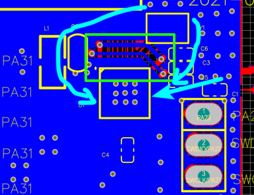

   图 1-19

天线回流无阻隔分析
~~~~~~~~~~~~~~~~~~~~~~~~~~~~~~~~~~~~~~~~~~~~

勉强可以, 优秀的应该让回流达到最短, 天线回流如图 1-20.

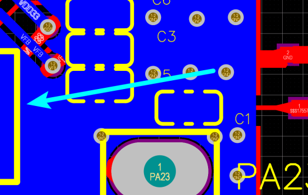

   图 1-20

电容靠近芯片引脚, 就近过孔、独立接地、回流无阻隔分析
~~~~~~~~~~~~~~~~~~~~~~~~~~~~~~~~~~~~~~~~~~~~~~~~~~~~~~~~~~~~~~~~~~~~~~~~~~~~~~~~~~~~~~~~
如图 1-21:

1号框内电容可以离芯片再近一点, 过孔距离较远;

2号框内3个电容没有独立过孔, 且最下面一个电容的地会影响天线的隔离地, 可以考虑

将此电容垂直摆放, 地pad在上端.

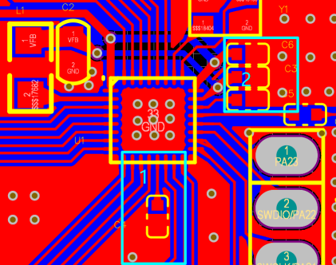

   图 1-21

RF信号通路走线短、宽、渐近线、无折线分析
~~~~~~~~~~~~~~~~~~~~~~~~~~~~~~~~~~~~~~~~~~~~

RF走线如图 1-22:

1号框内走线未与芯片焊盘宽度一致, 且中心不在一条线上, 稍微偏上了;

2、3号框内走线也没有等宽.

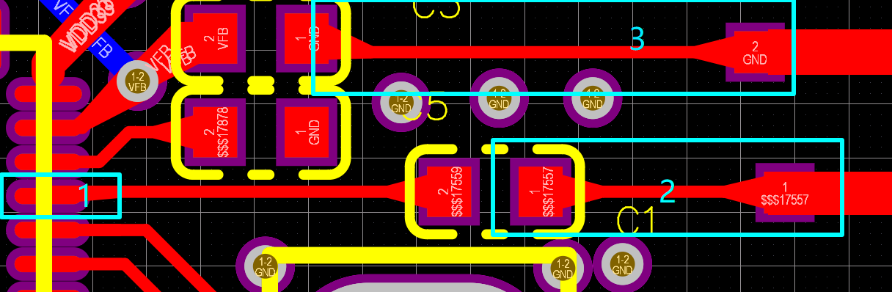

   图 1-22

RF铺铜如图 1-23:

1、2号框内明显不平整, 有折线;

3号框内PAD离RF太近了.

4号框内RF走线两侧明显没有等宽, 铺铜挖空中心不在RF走线中心上;

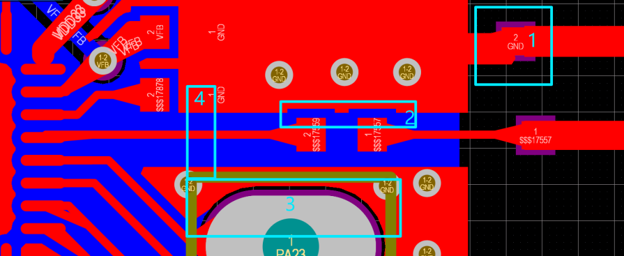

   图 1-23

高频(数字)信号远离RF信号通路、用铺铜做屏蔽分析
~~~~~~~~~~~~~~~~~~~~~~~~~~~~~~~~~~~~~~~~~~~~~~~~~~~~~~~~~~~~

如图 1-24:

1、3号框内高频信号都有被铺铜隔离;

2号框内电容的GND焊盘离天线太近, 建议垂直摆放, GND朝上.

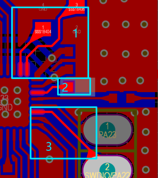

   图 1-24

电容/电感的选择分析
~~~~~~~~~~~~~~~~~~~~~~~~~~~~~~~~~~~~~~~~~~~~~~~~~~~~~~~~~~~~

参考电容未按建议值选择, 建议阅读“PCB参考设计推荐”的第六项, :ref:`Layout注意事项表 1-1 电容/电感选择<表 1-1 电容/电感选择>`.

芯片GNDpad处理隔分析
~~~~~~~~~~~~~~~~~~~~~~~~~~~~~~~~~~~~~~~~~~~~~~~~~~~~~~~~~~~~

GNDpad过孔合理, 建议将四个框内的pad引脚缩短, 以便于将芯片GND在TOP层就可以直接引出, 增加了芯片GND大而完整的特性, 如图
1-25.

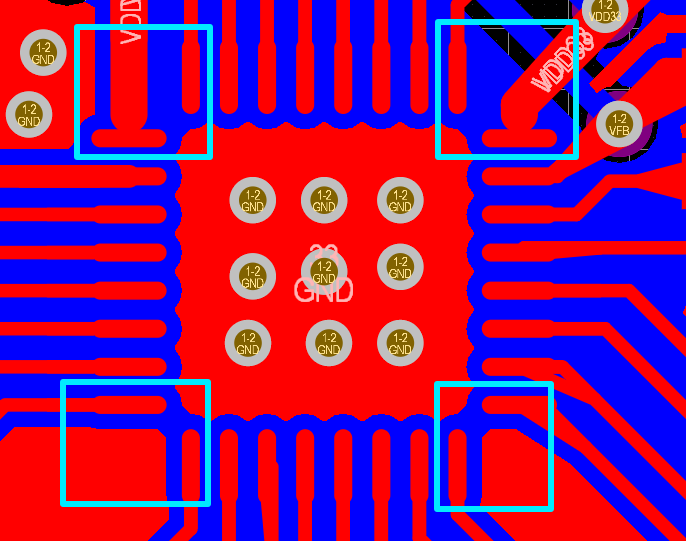

    图 1-25

晶振靠近芯片管脚分析
~~~~~~~~~~~~~~~~~~~~~~~~~~~~~~~~~~~~~~~~~~~~~~~~~~~~~~~~~~~~

晶振靠近了芯片管脚, 但未与芯片管脚在合适的中心线上, 建议晶振往右移动, 走线垂直, 减少折线, 如图
1-26.

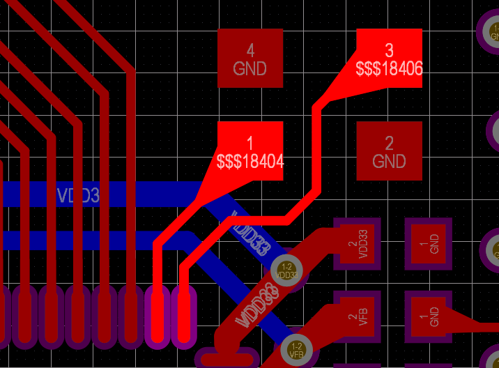

    图 1-26

振荡器件远离天线分析
~~~~~~~~~~~~~~~~~~~~~~~~~~~~~~~~~~~~~~~~~~~~~~~~~~~~~~~~~~~~

如图 1-27, DCDC电感在天线另一侧, 离天线较远, 摆放合理.

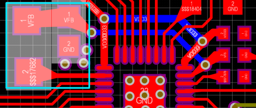

    图 1-27

各层天线区域净空分析
~~~~~~~~~~~~~~~~~~~~~~~~~~~~~~~~~~~~~~~~~~~~~~~~~~~~~~~~~~~~

如图 1-28, 框内未做到净空, 不合理.

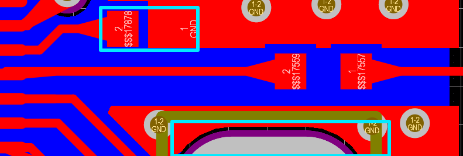

    图 1-28

其他分析
~~~~~~~~~~~~~~~~~~~~~~~~~~~~~~~~~~~~~~~~~~~~~~~~~~~~~~~~~~~~

1. 走线宽度合理;

2. TX、RX之间可以考虑留空地出来, 如图 1-29.

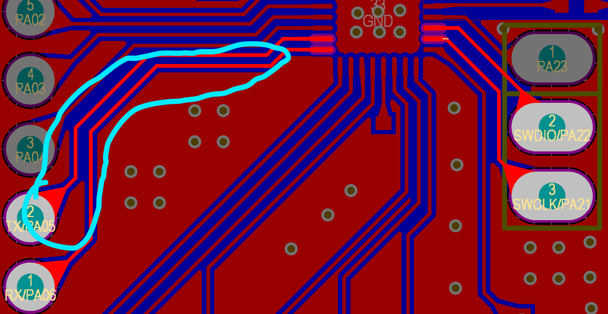

    图 1-29

3. Smith S11曲线测试不合理

   如图 1-30和图 1-31, 问题如下:

+----------------------------------+-----------------------------------+
|.. figure:: ../_images/image30.png|.. figure:: ../_images/image31.jpeg|
|   :alt: image30                  |    :alt: image31                  |
|   :height: 300px                 |    :height: 300px                 |
|   :align: center                 |    :align: center                 |
|                                  |                                   |
|   图 1-30                        |    图 1-31                        |
+----------------------------------+-----------------------------------+

1) 1号点位置因该在2号点(2.40000GHz)和3号点(2.480000GHz)之间;

2) 2号点(2.40000GHz)和3号点(2.480000GHz)增益较差.

PCB设计问题案列1
~~~~~~~~~~~~~~~~~~~~~~~~~~~~~~~~~~~~~~~~~~~~~~~~~~~~~~~~~~~~

根据客户反馈, 设计的PCB RF性能差, 如下图, 简要分析如下:

+----------------------------------+-----------------------------------+
|.. figure:: ../_images/image32.png|.. figure:: ../_images/image33.png |
|   :alt: image32                  |    :alt: image32                  |
|   :height: 300px                 |    :height: 300px                 |
|   :align: center                 |    :align: center                 |
|                                  |                                   |
|   图 1-32 PCB                    |    图 1-33 SCH                    |
+----------------------------------+-----------------------------------+

PCB:
--------
.. line-block::

   1. RF-->GND
      RF回流地受到VDD的走线影响, 不能直接回流到芯片, 从两侧回流, 且回流路径较窄, 高频下会产生电容效应.
   2. OSC--GND
      晶振地的铺铜接触不完整, 晶振地回流到芯片, 距离较远, 也会影响芯片性能.
   3. Chip--GND
      芯片顶层附近未铺地铜, 应当在0-GND焊盘上多过几个孔.
   4. RF--Polygon
      RF中轴线要直, 两侧铺铜要平整.
   5. VDD33
      VDD33走线经过RF下方, 导致RF地回流到芯片距离偏远.
   6. RST
      正常环境下, RST上放一个0.1uF电容即可.

SCH:
--------
原理图主要元件参数未按手册设计, 参见 :ref:`datasheet参考设计 <参考设计>`