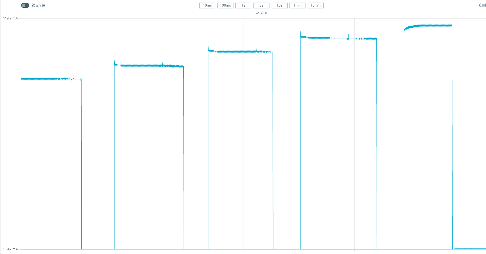
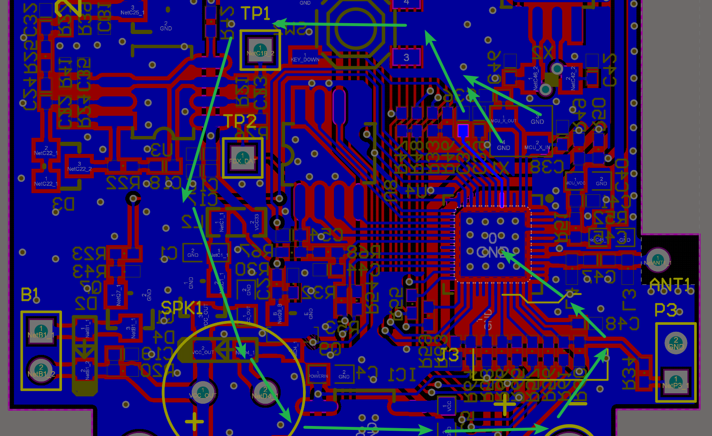
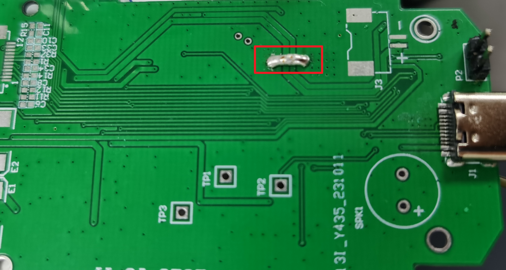

Layout设计错误样例(必看)
=========================

1. 电流功耗达到100mA, 芯片发烫。

   客户设计的板子中, 反馈程序运行不稳定。

   在VDD12上贴1nF电容, 功耗100多mA, 贴100nF则正常。如图:

   电流功耗图

**原因分析:** VDD12&晶振的GND, 回流芯片距离太长。如图

   PCB走线图

**解决办法:** GND跳线, 缩短GND的回流距离。如图:

   实物改进图
