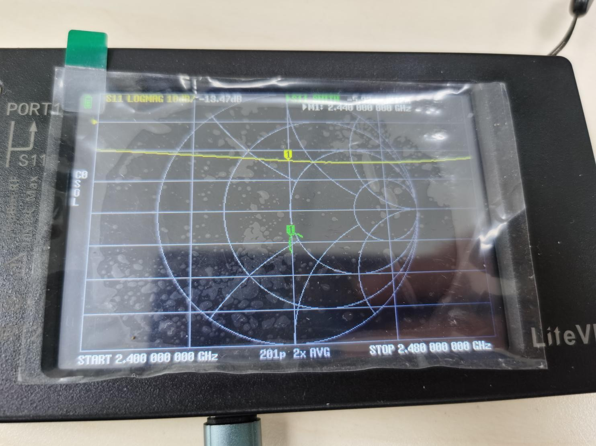

天线阻抗匹配
====================

调试目的
~~~~~~~~~~~~

   阻抗匹配参数, 是影响天线性能的关键. 蓝牙通信频率在 2402MHz~2480MHz, 标准天线反射系数S11<-10dB.
   以 2400MHz/2440MHz/2480MHz 三点为例,进行匹配时,S11越小越好.

   S11:  0dB 时, 芯片发射的信号, 全部反射回来.

   S11:-10dB 时, 芯片发射的信号, 只有 1% 被反射回来.

   为保证射频信号, 能在 RF 线路中高效传输. 2402MHz~2480MHz 这段
   S11, 最好能够全部<-10dB.

   天线分为2端: 芯片端(芯片内部RF天线), PCB天线端(PCB 板天线).

   因此 PCB 布线上需要预留 2 个"Π"型电路, 分别调试芯片端 & PCB天线, 达到
   50Ω阻抗. 大部分客户考虑成本或排版问题, 会只预留 1 个"Π"型电路, 或单串 1
   个元件.

材料准备
~~~~~~~~~~~~

一块焊接好的 PCBA, 同轴线连接 RF 串联元件 PAD 上, 与 PCB天线保持断开.
----------------------------------------------------------------------------------------------------------------

|

一块空板 PCB(未贴B6x芯片), 同轴线连接芯片 RF PAD 上.
------------------------------------------------------------

|

芯片 RF RX 接收模式程序:RF_RX 阻抗 2440MHz_0x4000.bin;(RF Tx 模式与断电一致)
--------------------------------------------------------------------------------

便携矢量网络分析仪: `LiteVNA 6G <https://urlify.cn/buaA3a>`__.
----------------------------------------------------------------

软件配置说明
~~~~~~~~~~~~~~~~

   通过烧录器或 Jflash, 将"RF_RX 阻抗 2440MHz_0x4000.bin"文件, 烧录到 PCBA
   中.

矢量网络分析仪配置说明
~~~~~~~~~~~~~~~~~~~~~~~~~~

新网络分析仪到手开机, 默认频率显示 10MHz~3GHz, 如下图:
------------------------------------------------------------

|
| (1) 关闭迹线 1+迹线 3(主菜单->显示->迹线):

|
| (2) 设置起始频率:2.40GHz,终止频率:2.48GHz(主菜单->频率参数->起始频率->终止频率):

|

拖动 MARK1 点, 设置标记点 1 的频率"2440MHz"
------------------------------------------------

|

RF 50 Ω阻抗匹配调试
~~~~~~~~~~~~~~~~~~~~~~~~~~~~

查看 PCBA 芯片端天线参数:
-------------------------

|
| (1) 查看芯片 RF Tx 的阻抗,保证芯片完全掉电即可:

|
| (2) 查看芯片 RF Rx 的阻抗,上电运行程序"RF_RX 阻抗 2440MHz_0x4000.bin":

|

上图可知, 芯片端 RF 的 RX 阻抗<-10dB, 满足需求. 但是 TX
的阻抗性能较差(-3dB), 需要将 TX 的阻抗往 50
Ω中心点去调. (由于 TX&RX, 不在同一点, 只能采取折中的办法).

|

查看空板 PCB 天线参数
----------------------------

| (1) 将Π型匹配短接,查看 PCB 天线 Smith 图和 S11 反射系数.如下:

|
| (2) 将 PCB 天线匹配后, Smith 图和 S11 反射系数.如下:

|
| (3) 进一步调整 PCB 天线以优化阻抗匹配.

|

因此,最终的 50 Ω阻抗匹配参数,如下图:

|

RF 共轭匹配调试
~~~~~~~~~~~~~~~~~~~~

   查看芯片端 RF 引脚的 50
   Ω阻抗匹配. 若 **反射系数>-6dB**, 而"Π型匹配电路"只有一个(PCB
   天线占用), 则需采用 **共轭匹配** 来调试 RF 参数.

   由于芯片端 RF 有 TX/RX
   两种不同的阻抗, 共轭只能针对其中一种, 进行优化. 即选择 RX
   共轭匹配, 芯片的接收数据能力会增强; 选择 TX 共轭匹配, 芯片的 TX
   发送数据能力会增强. 以 TX 共轭匹配为例:

查看芯片端 TX 阻抗参数
----------------------

|

共轭匹配是根据芯片端RF 的阻抗参数, 对 **负载(PCB天线)** 进行阻抗调整, 从而达到最大功率传输的目的.

网络分析仪校准
~~~~~~~~~~~~~~~~~~

1. 进入校准模式, 分别将校准头"OPEN/SHAORT/LOAD", 连接 S11 的 SMA, 进行校准.

2. 主菜单->校准->(连接 OPEN 校准头)->开路;

3. ->(替换为 SHAORT 校准头)->短路;

4. ->(替换为 LOAD 校准头)->负载;

5. ->完成->空白 0(保存);

|

6. 校准完成, 查看负载件是否位于 50Ω阻抗中心.

