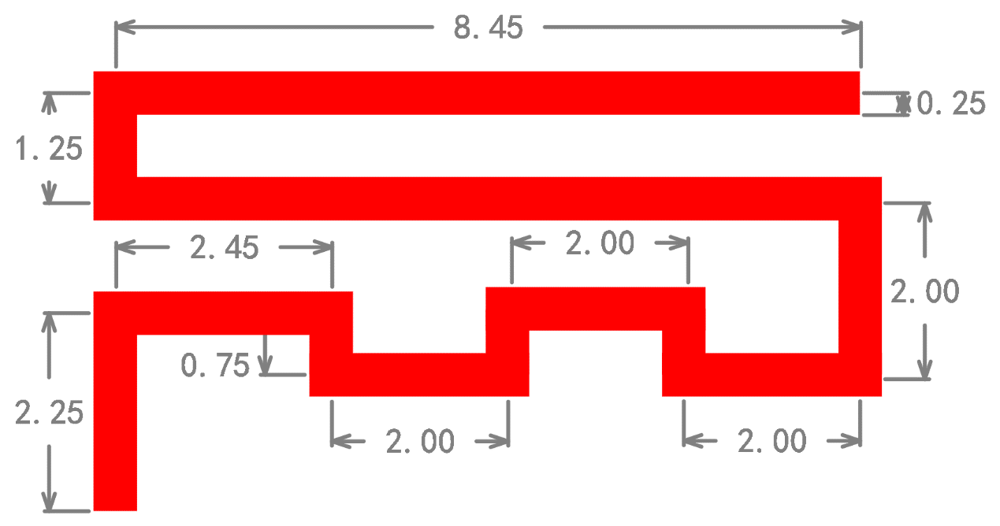
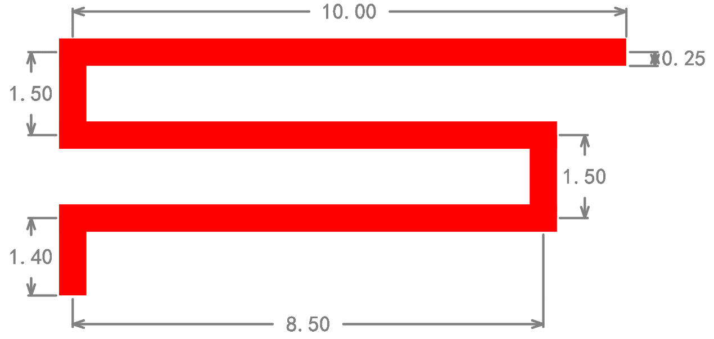
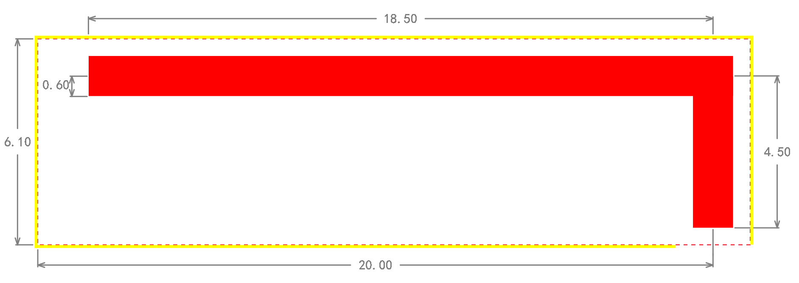
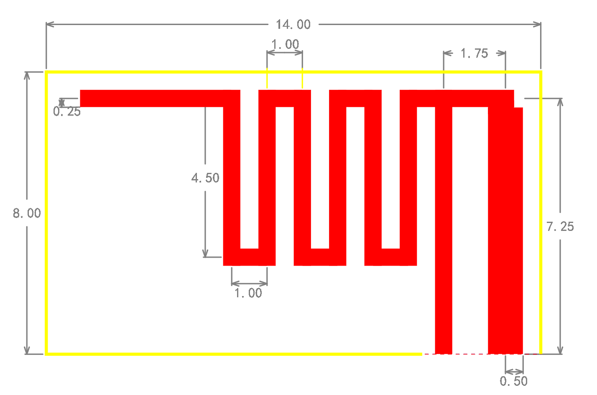
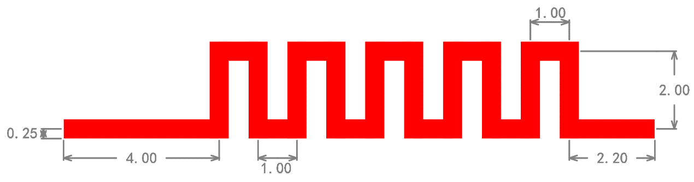

常用天线设计
======================

本文档介绍了五种常用天线的PCB设计,以指导客户绘制天线PCB图.

标注单位为:mm.

常用天线1
~~~~~~~~~~~~~~~~~~~~~~~~~~~~~~~~~~~~~~~~~~~~~~~~~~~~~~~~~~~~

   图 1-34 常用天线1

常用天线2
~~~~~~~~~~~~~~~~~~~~~~~~~~~~~~~~~~~~~~~~~~~~~~~~~~~~~~~~~~~~

   图 1-35 常用天线2

常用天线3
~~~~~~~~~~~~~~~~~~~~~~~~~~~~~~~~~~~~~~~~~~~~~~~~~~~~~~~~~~~~

   图 1-36 常用天线3

常用天线4
~~~~~~~~~~~~~~~~~~~~~~~~~~~~~~~~~~~~~~~~~~~~~~~~~~~~~~~~~~~~

   图 1-37 常用天线4

常用天线5
~~~~~~~~~~~~~~~~~~~~~~~~~~~~~~~~~~~~~~~~~~~~~~~~~~~~~~~~~~~~

   图 1-38 常用天线5

注意
~~~~~~~~~~~~~~~~~~~~~~~~~~~~~~~~~~~~~~~~~~~~~~~~~~~~~~~~~~~~

对于小尺寸设备端, 如dongle, 推荐使用常用天线1和2;对于尺寸没有苛刻要求的设备端, 如鼠标、遥控器等, 推荐使用常用天线3和
4;对于键盘应用, 推荐使用常用天线 5.
