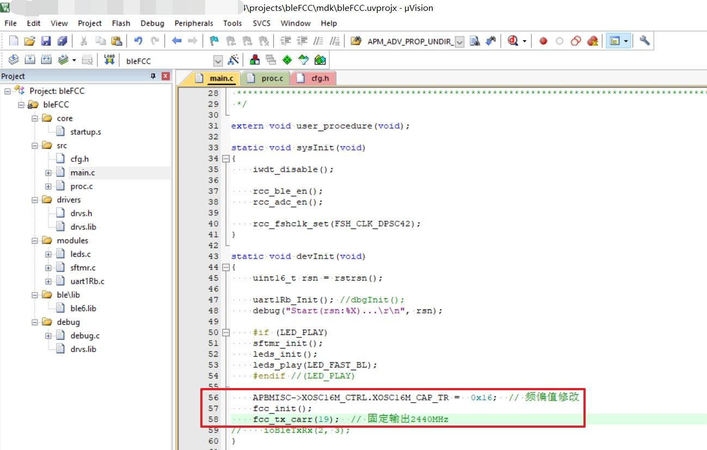
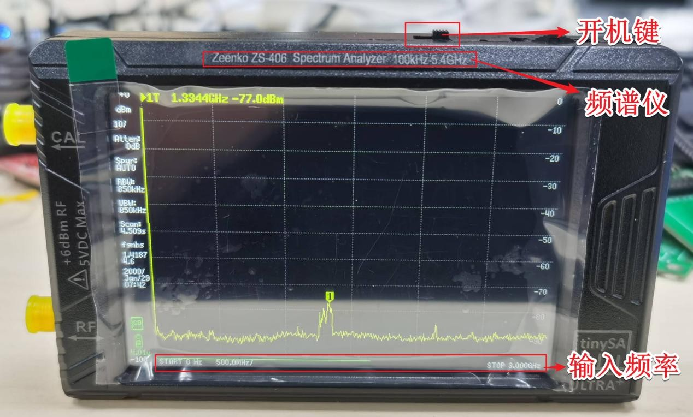
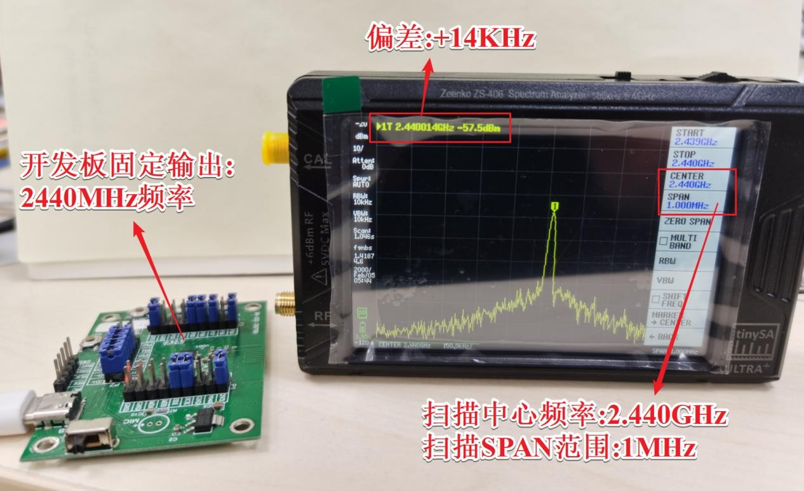
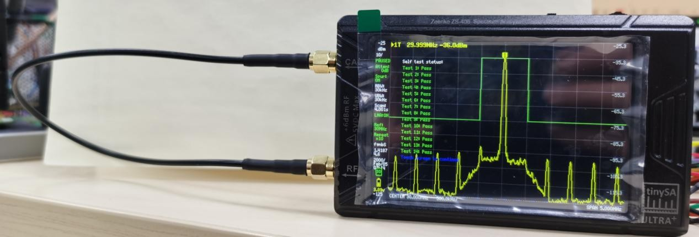

晶振频偏校准
====================

校准目的
~~~~~~~~~~~~

   频率的准确性, 是影响无线射频通信的关键. 蓝牙通信频率在
   2402MHz~2480MHz, 标准规范偏差是±150Khz. 以 2440000KHz
   为例, 进行校准并控制在±2Khz, 偏差越小越好.

   不同厂家批次的晶振, 以及 PCB 排版, 都会影响 16MHz
   输出偏差. 因此建议同款 PCB, 使用同厂家批次的晶振.

   更换晶振厂家或 PCB 排版, 则需要重新校准晶振 Trim 值.

材料准备
~~~~~~~~~~~~~

1. 用户待测 PCBA;

2. RF TX 单载波程序:SDK\\projects\\bleFCC\\mdk;

3. 便携频谱分析仪:`Zeenko ZS-406 Spectrum Analyzer 100kHz
   5.4GHz <https://urlify.cn/umQbqq>`__.

软件配置说明
~~~~~~~~~~~~~~~~~~~~

   由于 bleFCC 是串口控制程序, 为简便调试, 只需初始化控制
   2440MHz(19)频率输出.如下图.

   将 bleFCC 程序下载到待测 PCBA 上. 观测频谱分析仪上的
   频率, 通过修改 **APBMISC->XOSC16M_CTRL.XOSC16M_CAP_TR**, 直到满足需求.

|

频谱仪配置说明
~~~~~~~~~~~~~~~~~~~~~~~~~~~~~~~~

1. 新频谱仪到手后开机, 默认输入频率显示 0Hz~900MHz;

2. 单击屏幕, 菜单(CONFIG->MORE->ENABLEULTRA), 输入密码"4321". 解锁输入频率显示: 0~3GHz;

3. 返回主菜单(FREQUENCY->CENTER), 设置中心频率为(2440Mhz), 设置SPAN(1MHz).

|

实测展示
~~~~~~~~~~~~~~~~~~~~

1. 校准频率时, 无需同轴线连接频谱仪.(测功率时需要)

2. 由图可知, 此时的频率正偏了 14KHz. 可根据"软件配置说明"步骤, 继续优化.

|

频谱仪校准自检
~~~~~~~~~~~~~~~~~~~~

1. 频谱仪有自检校准功能, 需将 CAL->RF 的 SMA 口, 用同轴线短接.

2. 菜单(CONFIG->SELF TEST), 自检测试.

3. 菜单(CONFIG->LEVEL CAL), 校准功率测量.

