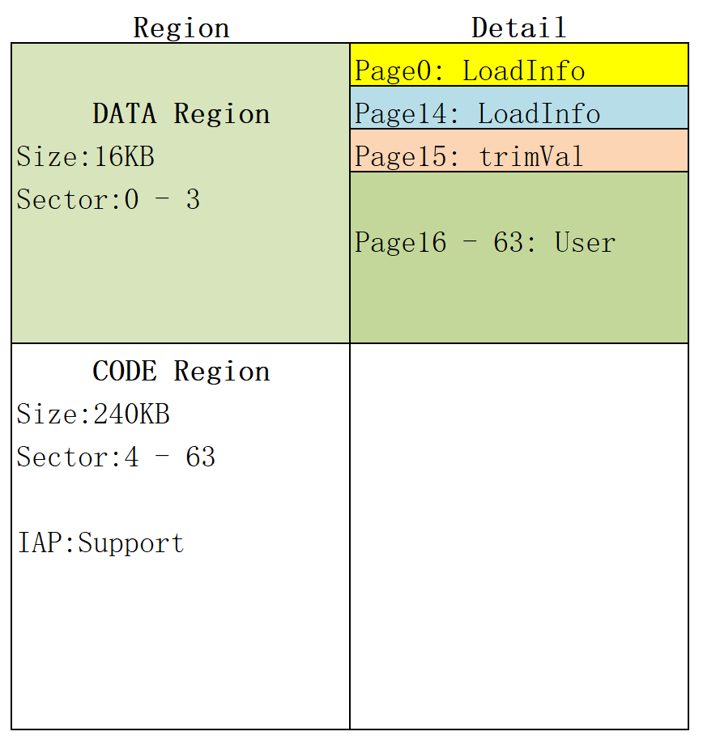

Flash Map
=========

.. line-block::

  以Flash大小为256KB为例( :ref:`封装不同, Flash大小不同.<sip_flash_label>` ), 分为 **DATA Region** 和 **CODE Region**.

  1. **DATA Region** 用于存放数据, 其中Page0~Page14为烧录的boot启动信息(LoadInfo), Page15为芯片出厂烧录的电压校准信息(trimVal). Page16 ~ Page63为用户自定义数据存储区域, 用于存放用户自定义数据, 如Ble Mac, LTK等.

  2. **CODE Region** 用于存放用户代码. 是否支持OTA需根据用户代码大小和Flash大小来决定. 如用户代码80KB, Flash 256KB, 则支持OTA. Flash 128KB, 则不支持OTA.

说明:
    1. Sector大小为 **4KB**, Page大小为 **256B**, 每个 **Sector** 包含 **16个Page**.
    2. **Page0** 对应Flash地址为0x0000 ~ 0x00FF,   **Page1** 对应Flash地址为0x0100 ~ 0x01FF, 以此类推.
    3. **Sector0** 对应Flash地址为0x0000 ~ 0x0FFF, **Sector1** 对应Flash地址为0x1000 ~ 0x1FFF, 以此类推.
    4. 对于Flash的地址有 **绝对地址** 和 **相对地址** 的说法.B6x Flash绝对基地址为 **0x18000000**. 相对地址是相对于基地址的偏移量.

|
| **Page0** 的 **boot启动信息(16Byte:0x00~0x0F)** 如下表1所示:

.. table:: 表 1 Boot启动信息

    ========================== ================= ================= =================
    4B(MagicCode)              +4B(CodeLength)   +4B(CodeAddress)  +4B(SramAddress)
    ========================== ================= ================= =================
    Flash or Sram Code         Code Length       Code Address      Sram Address
    eg:0xAA55A001(Sram Code)   eg:0x00000C44     eg:0x18004000     eg:0x20003600
    eg:0xAA55A004(Flash Code)  eg:0x00000C78     eg:0x18004000
    ========================== ================= ================= =================

说明:
    1. **MagicCode** 只支持 **0xAA55A001(Sram Code)** 和 **0xAA55A004(Flash Code)**.
    2. **CodeLength** 表示用户代码的字节长度, 仅对Sram Code有效(Sram Code是把代码从Flash中拷贝到Sram执行, Sram有大小限制).
    3. **CodeAddress** 表示用户代码烧录在Flash中的起始地址, 需确保在有效的Flash范围内, 目前SDK默认是配置为 **0x18004000**.
    4. **SramAddress** 表示用户代码在Sram中的起始地址, 需确保在有效的Sram范围内.
